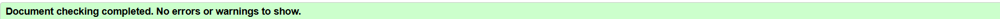
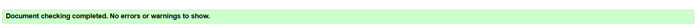
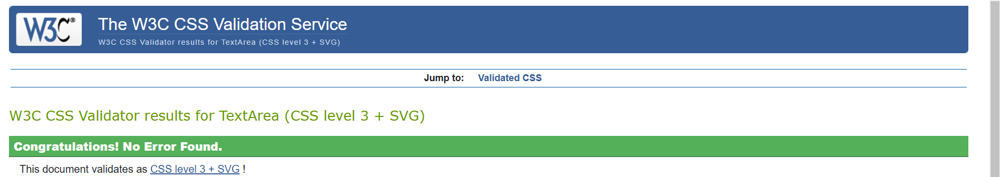
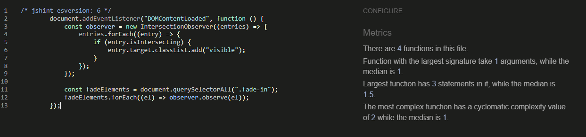

# Testing & Validation for Opt-In Page

## Overview
This document outlines all the testing and validation performed on the opt-in page project, including **automated tests**, **manual tests**, and **validation results**. The testing process ensures the site's functionality, responsiveness, accessibility, and compliance with coding standards.

## 1️⃣ Automated Tests
Automated tests were written using **Django’s unittest framework**. The following key functionalities were tested:

### ✅ **Unit Tests** (Executed via `python manage.py test landing.tests`)
| Test Name | Description | Status |
|-----------|------------|--------|
| `test_optin_form_valid` | Ensures the form accepts valid email and nickname | ✅ Passed |
| `test_optin_form_invalid_email` | Rejects improperly formatted emails | ✅ Passed |
| `test_optin_form_blank_fields` | Ensures required fields cannot be empty | ✅ Passed |
| `test_index_view` | Verifies that the main landing page loads correctly | ✅ Passed |
| `test_mailchimp_api_call` | Mocks the Mailchimp API call to verify correct execution | ✅ Passed |

### 🛠 **Running Automated Tests**
To execute all tests, run:
```bash
python manage.py test landing.tests
```

---

## 2️⃣ Manual Tests
The following manual tests were performed to ensure usability and functionality:

### ✅ **Form Submission Tests**
| Test Case | Expected Result | Status |
|-----------|----------------|--------|
| Enter valid email & nickname | Redirects to Thank You page | ✅ Passed |
| Enter invalid email format | Displays error message | ✅ Passed |
| Submit with empty fields | Displays required field errors | ✅ Passed |

### ✅ **Responsiveness Tests**
| Device | Status |
|--------|--------|
| Desktop (1920x1080) | ✅ Passed |
| Tablet (768px width) | ✅ Passed |
| Mobile (375px width) | ✅ Passed |

### ✅ **SEO & Accessibility Checks**
| Tool Used | Findings | Status |
|-----------|----------|--------|
| Lighthouse Audit | Good accessibility & SEO score | ✅ Passed |
| Google Mobile-Friendly Test | Confirmed mobile responsiveness | ✅ Passed |

---

## 3️⃣ Code Validation
The site’s **HTML, CSS, JavaScript, and Python** were validated using industry-standard tools:

| File Validated | Validation Tool | Validation Link | Screenshot |
|---------------|----------------|----------------|------------|
| `index.html` | [W3C HTML Validator](https://validator.w3.org/) | **No errors found** |  |
| `thank_you.html` | [W3C HTML Validator](https://validator.w3.org/) | **No errors found** |  |
| `optin.css` | [W3C CSS Validator](https://jigsaw.w3.org/css-validator/) | **No errors found** |  |
| `script.js` | [JSHint](https://jshint.com/) | **Fixed ES6 warnings > No errors found** |  |
| `Python Code` | **Black & Flake8** | **All code formatted & validated** | ✅ |

### 🔍 **Python Code Validation**
To ensure **PEP8 compliance**, run the following commands:
```bash
# Format code using Black
black .

# Lint code using Flake8
flake8 . --max-line-length=79
```

---

## 4️⃣ Bugs & Fixes

### 🔧 **Fixed Issues**
| Issue | Fix Implemented |
|-------|----------------|
| Static files not loading | Used **WhiteNoise** for serving static files in production |
| Mailchimp API failures | Verified **API key and audience ID** in `.env` file |
| Deployment errors on Render | Corrected **build command** and ensured `.env` variables were set |

### 🛑 **Unresolved Issues**
| Issue | Notes |
|-------|-------|
| Cloudinary integration failure | Images were not appearing correctly, so **WhiteNoise** was used instead |

---

## 5️⃣ Future Enhancements
- **Automated Ping Bot**: Implement a scheduled bot (e.g., cron job, UptimeRobot) to periodically ping the site, preventing long reboot times on Render.
- **Enhanced Admin Panel**: Add an admin dashboard to track email signups.
- **A/B Testing**: Test different landing page variations to improve conversions.
- **Advanced Analytics**: Integrate **Google Analytics** or **Plausible Analytics**.
- **Dark Mode Support**: Add a toggle for dark mode.
- **Email Customization**: Allow users to select preferred email content.
- **Multilingual Support**: Expand reach with multiple language options.

---

## Conclusion
All essential functionalities were tested and validated. The site is **responsive, functional, and ready for deployment** with minimal known issues. Future updates will focus on **performance optimizations and user engagement improvements**.

📌 **Next Steps:** Monitor user interactions and refine based on feedback. 🚀